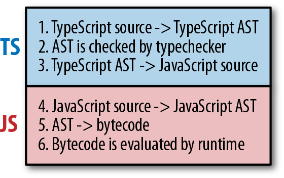
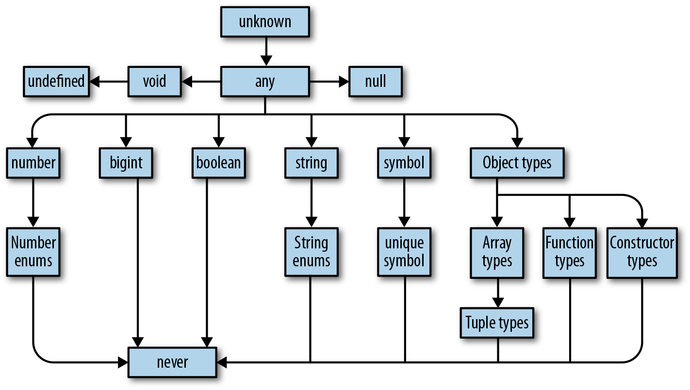

# Learning TypeScript

General notes from various resources including but not limited to:

- Programming TypeScript by Boris Cherny.
- Educative's course: Learn TypeScript: The Complete Course for Beginners.
- TypeScript documentation.

## Commands

- install TSC, TSLint, and type declarations for NodeJS

```bash
npm install --save-dev typescript tslint @types/node
```

- generate a tslint.json file with the default TSLint configuration

```bash
node_modules/.bin/tslint --init
```

- compile your Typescript with TSC

```bash
node_modules/.bin/tsc
```

- run your code with NodeJS

```bash
node dist/index.js
```

## Overview

- Instead of compiling straight to bytecode, TypeScript compiles to JavaScript code.
- After the TypeScript compiles the code and generates an AST of the program, but before it emits the code, it typechecks the code.



- JavaScript compilers and runtimes tend to be smushed into a single program called an engine.
- In TypeScript, you can explicitly annotate your types, or you can let TypeScript infer most of them for you.
- TypeScript is a gradually typed language. Meaning that it works best when it knows the types of everything in your program at compile time, but not every type.
- TypeScript typechecks code at compile time.
- TypeScript throws both syntax-related errors and type-related errors at compile time.
- types tree:

